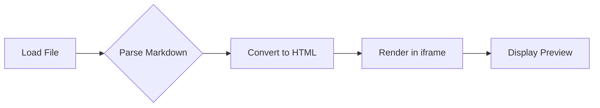
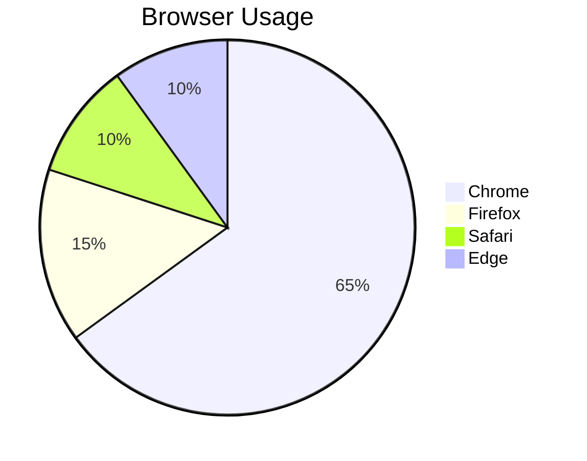

# Sample Markdown Document

This is a **test document** for the Markdown Viewer.

## Features

- Live editing with real-time preview
- Font selection (curated + custom)
- Mermaid diagram support
- Print / export functionality

## Code Example

```javascript
function greet(name) {
    return `Hello, ${name}!`;
}
```

## Table

| Feature | Status |
|---------|--------|
| Markdown parsing | Done |
| Mermaid support | Done |
| Font selection | Done |
| Print | Done |

## Mermaid Flowchart



## Mermaid Pie Chart



> This is a blockquote to test styling.

---

That's all folks!
